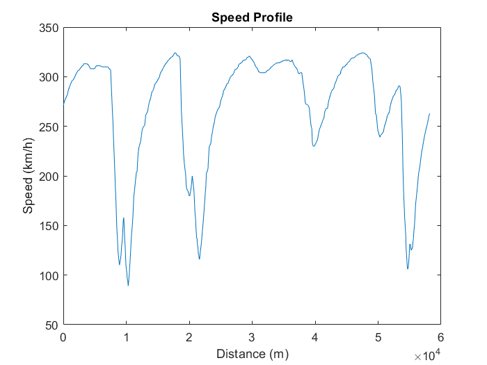
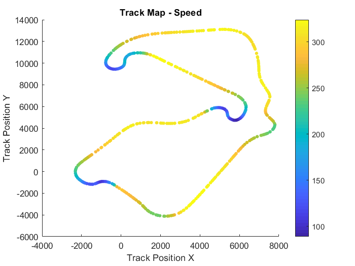
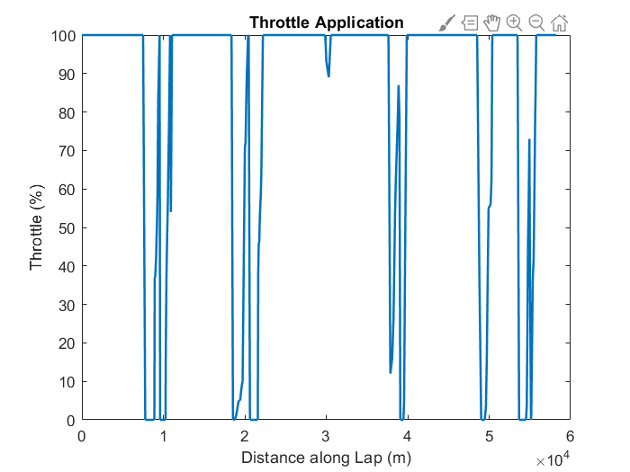
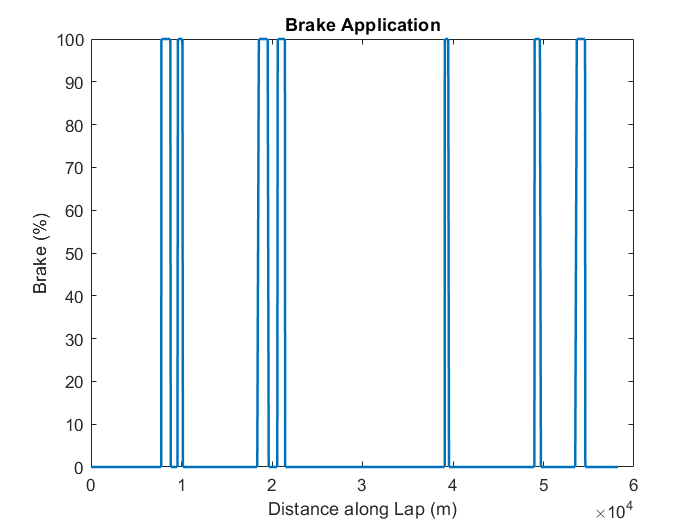

# f1-telemetry-analysis
F1 telemetry data analysis of Max Verstappen's pole lap at the 2025 Silverstone Grand Prix using MATLAB and Python (FastF1)

## F1 Telemetry Analysis

A MATLAB tool for analysing real F1 telemetry data using the FastF1 Python Library

Data is pulled from official F1 timing systems and exported to CSV, then visualised in MATLAB

Channels analysed: speed, throttle, brake

